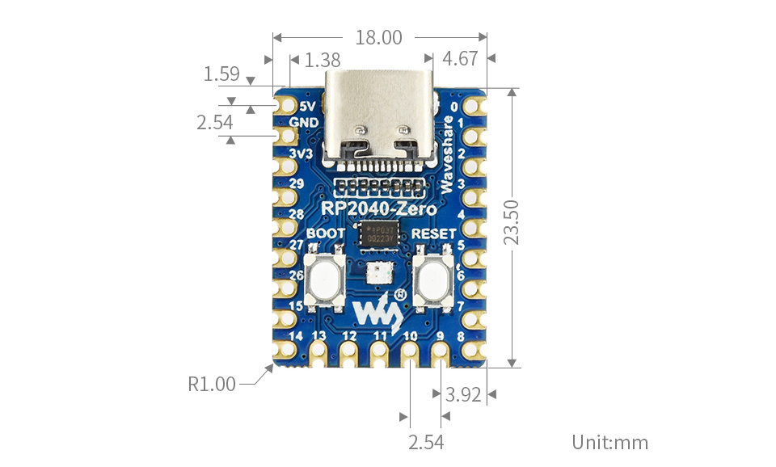

Sandbox to play with RP2040 Zero microcontroller and do some embedded magic.

# RP2040-Zero

## Overview

RP2040-Zero, A Low-Cost, High-Performance Pico-Like MCU Board Based On Raspberry Pi Microcontroller RP2040.

## Specification

- RP2040 microcontroller chip designed by Raspberry Pi in the United Kingdom.
- Dual-core Arm Cortex M0+ processor, flexible clock running up to 133 MHz.
- 264KB of SRAM, and 2MB of on-board Flash memory.
- USB-C connector, keeps it up to date, easier to use.
- The castellated module allows soldering direct to carrier boards.
- USB 1.1 with device and host support.
- Low-power sleep and dormant modes.
- Drag-and-drop programming using mass storage over USB.
- 29 × multi-function GPIO pins (20× via edge pinout, others via solder points).
- 2 × SPI, 2 × I2C, 2 × UART, 4 × 12-bit ADC, 16 × controllable PWM channels.
- Accurate clock and timer on-chip.
- Temperature sensor.
- Accelerated floating-point libraries on-chip.
- 8 × Programmable I/O (PIO) state machines for custom peripheral support.

## Additional Resources

For more detailed information, including pinouts, dimensions, and technical documentation, please visit the [Waveshare RP2040-Zero wiki page](https://www.waveshare.com/wiki/RP2040-Zero).